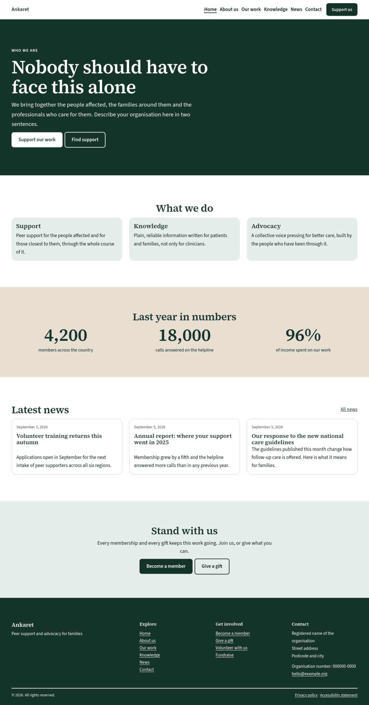

# Ideell

A WordPress block theme for nonprofit associations.



Charities, foundations, patient organisations and unions publish much the same handful of things. An appeal. A description of the work. A knowledge base. A board. An annual report. Most themes leave you to assemble all of it from scratch, so small organisations either pay an agency or put up something that looks provisional.

Ideell ships those sections as block patterns, on a typographic system built for long-form reading, and holds to WCAG 2.2 AA throughout.

The name is the Swedish word for non-profit, as in *ideell förening*. <!-- ideell-allow -->

## Status

In development. Not yet submitted to the WordPress theme directory.

## Requirements

WordPress 6.7 or later. PHP 8.1 or later.

## Installation

Put the theme in `wp-content/themes/ideell` and activate it under Appearance › Themes.

## What is included

**Twenty-two patterns.** Enough for a full homepage and the inner pages around it.

| | |
|---|---|
| Opening | hero, hero with photograph, page lead |
| Sections | programme cards, impact figures, statistics row, knowledge base band, image and text, lived experience, FAQ |
| Asking | campaign appeal with a progress element, support call to action, newsletter, volunteer |
| Listing | news teaser, post archive, upcoming events |
| Organisation | board and people grid, contact and support routes, header, footer, 404 |

All of it is plain core block markup. The FAQ uses the core accordion block, so
core owns the keyboard interaction and the ARIA wiring rather than the theme
reimplementing them.

**Six style variations.** Evergreen by default, plus Plum, Nordic Blue, Ochre, Ink and High Contrast. High Contrast reaches WCAG AAA on every text pair.

**Section and Card.** Two block variations of `core/group` that appear in the inserter under their own names. Cards stretch to match the tallest in a row and keep a pinned link or button aligned across it. They save as ordinary `core/group`, so anything written with them stays valid if the site later moves to another theme.

**Typography.** Source Serif 4 for display, Source Sans 3 for text. Both variable, both self-hosted, both split by `unicode-range`. A page in English or Swedish pulls roughly 78 KB of font and leaves the Greek and Cyrillic subsets on disk. Nothing is fetched from a third party, so the theme does not put a site in the awkward position of shipping visitor IP addresses to a font CDN.

**Colour.** An Evergreen palette addressed by role (`primary`, `secondary`, `ink`, `line`) rather than by hue. A style variation can restate the whole palette without touching a single pattern.

## Accessibility

Contrast is not judged by eye. `contrast.mjs` reads the palette out of `theme.json` and every style variation, then checks eighteen semantic pairs per palette, 108 in all. Sixteen are WCAG 2.2 AA thresholds for text and UI. The other two check that a tinted card or band is actually perceptible against the page: not a WCAG rule, since a container is not a control, but the check that catches a surface which has quietly become invisible.

`check-patterns.php` renders every pattern and audits the resulting HTML for unrendered blocks, skipped heading levels, more than one `h1`, images with no `alt` attribute, and links with no accessible name. All twenty-two pass.

`shoot-variations.sh` screenshots the theme under all six palettes and assembles a contact sheet, so the numbers can be checked against what they actually look like.

Also handled: focus rings that stay visible by inverting on dark surfaces, a styled skip link, the current page marked with an underline rather than colour alone, `prefers-reduced-motion` respected, and form fields given a real border through `theme.json`.

## Development

Drop the repo into `wp-content/themes/ideell` of any WordPress 6.7 or later
install and activate it. The checks run against the theme source, and the two
that need a browser run against a site you already have serving the theme.

```
npm install
npm run contrast                      # WCAG AA gate across all six palettes
npm run a11y http://localhost:8888/   # axe, against a running site
```

`scripts/check-patterns.php` renders and audits every pattern. Run it through
WP-CLI against an install with the theme active:

```
wp eval-file scripts/check-patterns.php "ideell/"
```

Design tokens belong in `theme.json`. Layout belongs in `templates/`, `parts/` and `patterns/`. `assets/css/app.css` is only for the few things `theme.json` cannot say, and should stay short.

## Licence

GPL-2.0-or-later. See `LICENSE`.

Source Serif 4 and Source Sans 3 are copyright Adobe, released under the SIL Open Font License 1.1. The full licence texts sit alongside the font files in `assets/fonts/`.
